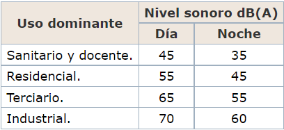

Cargamos las librerias necesarias.
```{r include = F, echo=F}
#Cargamos todas las librerias necesarias para trabajar.
packages=c("tidyverse", "knitr", "ggplot2", "datasets", "RColorBrewer", "dplyr", "readr", "tidyr","lubridate","gganimate","plotly","png","ggpubr","colorspace","magrittr","car","GGally","jsonlite", "reshape","stats","vcd")

# use this function to check if each package is on the local machine
# if a package is installed, it will be loaded
# if any are not, the missing package(s) will be installed and loaded
package.check <- lapply(packages, FUN=function(x) {
  if (!require(x, character.only=TRUE)) {
    install.packages(x, dependencies=TRUE,repos='http://cran.rediris.es')
    library(x, character.only=TRUE)
  }
})
opts_chunk$set(include = T, echo=F, message = F, error = T, warning = F, comment = NA, eval = T, fig.align = 'center', dpi = 200, tidy = F, cache.path = '.cache/', fig.path = './figura/')
# verify they are loaded
search()
```

Limpiamos el entorno de trabajo antes de comenzar a trabajar.

```{r}
rm(list = ls())
```

# Crear el repositorio ProyectoTD2022
El repositorio se encunetra en el siguinete enlace: https://github.com/Josepgirpla/ProyectoTD2022.git

# Descargar y almacenarlos los ficheros de datos
Los ficheros han sido almacenados en la carpeta ./data contenida en el proyecto

# Importación y fusión de los datos
Importamos los datos descargados en distintos dataframes. Usando la función read_csv, y cambiando el tipo de la columna dateObserved a fecha
```{r}

Cadiz_3 <- read_csv("data/Cadiz_3.csv",
                    col_types = cols(dateObserved = col_date(format = "%Y-%m-%d")))

Cadiz_16 <- read_csv("data/Cadiz_16.csv",
                    col_types = cols(dateObserved = col_date(format = "%Y-%m-%d")))

Carles_Cervera_34 <- read_csv("data/Carles_Cervera_34.csv",
                    col_types = cols(dateObserved = col_date(format = "%Y-%m-%d")))

Carles_Cervera_Chaflan_Reina_Dona_Maria <- read_csv("data/Carles_Cervera_Chaflan_Reina_Dona_Maria.csv",
                    col_types = cols(dateObserved = col_date(format = "%Y-%m-%d")))

Cuba_3 <- read_csv("data/Cuba_3.csv",
                    col_types = cols(dateObserved = col_date(format = "%Y-%m-%d")))

Doctor_Serrano_21 <- read_csv("data/Doctor_Serrano_21.csv",
                    col_types = cols(dateObserved = col_date(format = "%Y-%m-%d")))

General_Prim_Chaflan_Donoso_Cortes <- read_csv("data/General_Prim_Chaflan_Donoso_Cortes.csv",
                    col_types = cols(dateObserved = col_date(format = "%Y-%m-%d")))

Puerto_Rico_21 <- read_csv("data/Puerto_Rico_21.csv",
                    col_types = cols(dateObserved = col_date(format = "%Y-%m-%d")))

Salvador_Abril_Chaflan_Maestro_Jose_Serrano <- read_csv("data/Salvador_Abril_Chaflan _Maestro_Jose_Serrano.csv",
                    col_types = cols(dateObserved = col_date(format = "%Y-%m-%d")))

Sueca_2 <- read_csv("data/Sueca_2.csv",
                    col_types = cols(dateObserved = col_date(format = "%Y-%m-%d")))

Sueca_32 <- read_csv("data/Sueca_32.csv",
                    col_types = cols(dateObserved = col_date(format = "%Y-%m-%d")))

Sueca_61 <- read_csv("data/Sueca_61.csv",
                    col_types = cols(dateObserved = col_date(format = "%Y-%m-%d")))

Sueca_Esq_Denia <- read_csv("data/Sueca_Esq_Denia.csv",
                    col_types = cols(dateObserved = col_date(format = "%Y-%m-%d")))

Vivons_Chaflan_Cadiz <- read_csv("data/Vivons_Chaflan_Cadiz.csv",
                    col_types = cols(dateObserved = col_date(format = "%Y-%m-%d")))
```


Manipulamos los datos para obtener un solo dataframe bien estructurado, añadiendo una columna con el nombre de la calle.
```{r}
#Añadimos una columna que contenga el nombre de la calle para poder identificarlas despues.
Cadiz_16 <- cbind(Cadiz_16, Nombre_calle = c("Cadiz_16"))

Cadiz_3 <- cbind(Cadiz_3, Nombre_calle = c("Cadiz_3"))

Carles_Cervera_34 <- cbind(Carles_Cervera_34, Nombre_calle = c("Carles_Cervera_34"))

Carles_Cervera_Chaflan_Reina_Dona_Maria <- cbind(Carles_Cervera_Chaflan_Reina_Dona_Maria,
                                                 Nombre_calle = c("Carles_Cervera_Chaflan_Reina_Dona_Maria"))

Cuba_3 <- cbind(Cuba_3, Nombre_calle = c("Cuba_3"))

Doctor_Serrano_21 <- cbind(Doctor_Serrano_21, Nombre_calle = c("Doctor_Serrano_21"))

General_Prim_Chaflan_Donoso_Cortes <- cbind(General_Prim_Chaflan_Donoso_Cortes,
                                            Nombre_calle = c("General_Prim_Chaflan_Donoso_Cortes"))

Puerto_Rico_21 <- cbind(Puerto_Rico_21, Nombre_calle = c("Puerto_Rico_21"))

Salvador_Abril_Chaflan_Maestro_Jose_Serrano <-cbind(Salvador_Abril_Chaflan_Maestro_Jose_Serrano,
                                                    Nombre_calle = c("Salvador_Abril_Chaflan_Maestro_Jose_Serrano"))

Sueca_2 <- cbind(Sueca_2, Nombre_calle = c("Sueca_2"))

Sueca_32 <- cbind(Sueca_32, Nombre_calle = c("Sueca_32"))

Sueca_61 <- cbind(Sueca_61, Nombre_calle = c("Sueca_61"))

Sueca_Esq_Denia <- cbind(Sueca_Esq_Denia, Nombre_calle = c("Sueca_Esq_Denia"))

Vivons_Chaflan_Cadiz <- cbind(Vivons_Chaflan_Cadiz, Nombre_calle = c("Vivons_Chaflan_Cadiz"))


#Unimos todos los df en uno solo.
df <- rbind(Cadiz_16, Cadiz_3, Carles_Cervera_34, Carles_Cervera_Chaflan_Reina_Dona_Maria,
            Cuba_3, Doctor_Serrano_21, General_Prim_Chaflan_Donoso_Cortes, Puerto_Rico_21,
            Salvador_Abril_Chaflan_Maestro_Jose_Serrano, Sueca_2, Sueca_32, Sueca_61,
            Sueca_Esq_Denia, Vivons_Chaflan_Cadiz)

#Modificamos los nombres de las columnas por unos más representativos.
colnames(df) <- c("Id", "Fecha_registro", "Servicio_sensor", "Tipo_entidad_sensor", "Id_sensor",
                  "Nivel_sonoro_continuo_equivalente", "Nivel_sonoro_dia",
                  "Nivel_sonoro_dia_tarde_noche", "Nivel_sonoro_tarde",
                  "Nivel_sonoro_noche", "Dia_medicion", "Nombre_calle")

df %>% head() %>% kable()
df %>% summary %>% kable()

```

Para terminar con este apartado vamos a realizar un análisis de los valores especiales o inconsistencias que puedan aparecer en nuestro dataframe, ya que como podemos ver en el summary anterior nos sale que hay valores infinitos, que los vamos a reemplazar por la media.
```{r}
#Primero vamos a determinar si hay o no datos especiales.

for (n in as.factor(colnames(df))){
  tabla_inconsist <- df %>% count(is.finite(n))
  
  if (tabla_inconsist[1,2] < nrow(df)){
    print(n)
    print(tabla_inconsist[1,2])
    }
}

#Realizamos una detección para cada columna con posibles valores especiales y los sustituimos por la media de todos los de su misma variable.

#Nivel_sonoro_continuo_equivalente
Nivel_sonoro_continuo_equivalente = df[,6]
Nivel_sonoro_continuo_equivalente[!is.finite(Nivel_sonoro_continuo_equivalente)] <- NA
Nivel_sonoro_continuo_equivalente_media = mean(Nivel_sonoro_continuo_equivalente, na.rm = T)

df[which(!is.finite(unlist(df[6]))),6] <- Nivel_sonoro_continuo_equivalente_media

#Nivel_sonoro_dia
nivel_sonoro_dia = df[,7]
nivel_sonoro_dia[!is.finite(nivel_sonoro_dia)] <- NA
nivel_sonoro_dia_media = mean(nivel_sonoro_dia, na.rm = T)

df[which(!is.finite(unlist(df[7]))),7] <- nivel_sonoro_dia_media

#Nivel_sonoro_dia_tarde_noche
 Nivel_sonoro_dia_tarde_noche = df[,8]
 Nivel_sonoro_dia_tarde_noche[!is.finite( Nivel_sonoro_dia_tarde_noche)] <- NA
 Nivel_sonoro_dia_tarde_noche_media = mean( Nivel_sonoro_dia_tarde_noche, na.rm = T)

df[which(!is.finite(unlist(df[8]))),8] <-  Nivel_sonoro_dia_tarde_noche_media

#Nivel_sonoro_tarde
nivel_sonoro_tarde = df[,9]
nivel_sonoro_tarde[!is.finite(nivel_sonoro_tarde)] <- NA
nivel_sonoro_tarde_media = mean(nivel_sonoro_tarde, na.rm = T)

df[!is.finite(nivel_sonoro_tarde),9] <- nivel_sonoro_tarde_media

#Nivel_sonoro_tarde
Nivel_sonoro_noche = df[,10]
Nivel_sonoro_noche[!is.finite(Nivel_sonoro_noche)] <- NA
Nivel_sonoro_noche_media = mean(Nivel_sonoro_noche, na.rm = T)

df[!is.finite(Nivel_sonoro_noche),10] <- Nivel_sonoro_noche_media


#Volvemos a aplicar el bucle anterior para comprovar que ya no hay datos especiales.
for (n in as.factor(colnames(df))){
  tabla_inconsist <- df %>% count(is.finite(n))
  
  if (tabla_inconsist[1,2] < nrow(df)){
    print(n)
    print(tabla_inconsist[1,2])
    }
}

df %>% head() %>% kable()
```
# Importación de datos complementarios
Para contestar una de las preguntas que hemos planteado requerimos de datos adicionales. Los datos que vamos a importar son un registro meteorológico de la ciudad de Valencia entre los años 2020 y 2022 recogidos por la Agencia Estatal de Meteorología (AEMET) y que se han puesto a disposición de todo el mundo a traves de la iniciativa "AEMET OpenData".

La descarga de los datos requiere de una solicitud previa que requiere de un código de usuario proporcionado por la propia AEMET, además, la descarga de los datos tiene una caducidad y es por ello que no es posible dejar un enlace fijo en el código para ir actualizando los datos. Es por ello que hemos tenido que descargar previamente los datos.

Los datos se proporcionan en formato JSON y requieren de cierto tratamiento que seguidamente haremos para poder utilizarse.

```{r}
#Guardado de los datos desde un enlace de AEMET (Cada vez que se quiera actualizar los datos es necesario iniciar sesión dado que el enlace tiene un tiempo de expiración

#filename <- "https://opendata.aemet.es/opendata/sh/62606870"
#weather_data <- read_file(filename)
#write_json(weather_data, "data/Weather_data.json")
```

Estos son los datos tal y como se nos proporcionan:
```{r}
#Importamos los datos que hemos descargado en formato .json a un data frame.
df_weather <- fromJSON("data/Weather_data.json")
head(df_weather)
```

## Preguntas a reponder en el proyecto

Para empezar a desarroyar el proyecto, vamos a formular una serie de preguntas que buscaremos responder mediante la interpretación de los datos aportados.

###  1. ¿Cuáles son las calles mas ruidosas en cada momento del día?¿Existen diferencias entre los fines de semana y el resto de días?
  
  *Respuesta*
  
  Si nos centramos en las diferencias que existen en los niveles de contaminación acústica entre los fines de semana y el resto de la semana nos damos cuenta rapidamente de que desde los jueves por la tarde hasta los domingos de madrugada los niveles sonoros aumentan considerablemente superando con creces los límites legales que la Ley 7/2002, de 3 de diciembre, de protección contra la contaminación acústica establece como límites legales.
  
###  2. ¿En algún momento el barrio de Ruzafa supera los estándares impuestos en la ley estatal de ruido?
  
  *Respuesta*
  
  Si, como más adelante explicaremos con los gráficos realizados durante el estudio de contaminación acústica en el barrio de Ruzafa y con los datos observados y comparando los niveles sonoros con los establecidos en la ley de contaminación acústica podemos afirmar que el barrio de Ruzafa esta por encima de los estándares en todas las horas del día durante todos los días de la semana. 
  
###  3. ¿Podemos determinar horarios o patrones de ruido en los datos recogidos por los sensores?
  
  *Respuesta*
  
  Después de realizar nuestro análisis hemos concluido que si podemos detectar algunos patrones u horarios gracias a los datos recogidos por los sensores, como más adelante y durante el desarrollo del estudio veremos.

Haciendo un breve resumen hemos encontrado un patron que se repite a lo largo de todas las semanas, durante los lunes, martes y miércoles tenemos los registros más bajos en cunto a decibelios, pero a medida que se acerca el jueves y el fin de semana los niveles registrados por los sonómetros se disparan.
  
###  4. ¿Existe alguna relación entre los días festivos en la ciudad y un cambio en la tendencia de los datos recogidos?
  
  *Respuesta*
  
  Nuestra hipotesis inicial es que si existe una relación entre las festividades más importantes del barrio de Ruzafa así como las de la ciudad de Valencia. Hemos dibujado un gráfico donde agrupamos en el nivel sonoro por meses del año ya que hacer un estudio solo por días no era demásiado representativo.
  
  Una vez con el gráfico hecho y tras analizar en más profundidad las festividades que cumplen los requisitos en cuanto a duración y calibre (gente a la que atrae la festividad, nivel de actividad en las calles debido a la fiesta en cuestión) de la festividad concluimos que vemos cambios significativos en el mes de marzo, cosa que esperabamos ya que en este mes se celebra una de las fiestas más importantes de Valencia, sino la más importante. Notamos un amuento en los niveles registrados ya que en estas fiestas las actividades principales són hacer mascletaes, fuegos artificiales y de más actividades que generen un alto nivel sonoro. 
  
  En contra partida nos dimos cuenta que este patrón no se seguia para el resto de festividades consideradas como la semana santa, donde se realizan procesiones y demás actividades al aire libre y podían causar un aumento en los niveles registrados por los sonómetros. Tampoco detectamos aumentos para las fiestas de navidad, ni para el periodo vacacional de verano de los calendarios lectivos. La explicación que encontramos para esto ha sido que tanto en verano como navidades o semana santa mucha gente aprovecha para volver a sus casas y estar con la familia. Y como el barrio de ruzafa esta frecuentado por gente joven o estudiantes durante estos periodos no residen en el barrio y por eso no vemos un aumento considerable en los niveles de ruido.
  
  Por tanto podemos concluir que nuestra hipotesis inicial no era correcta.
  
###  5. ¿Podemos tratar de deducir el provocante de un ruido anormal a partir de la posición de un sensor?
  
  *Respuesta*
  
  Con los datos que tenemos y el estudio realizado sobre ellos, creemos que no es posible deducir que provoca un ruido anormal, ya que los sonómetros solo registran el nivel de decibelios y por tanto por su ubicación es difícil saber si el provocante es un coche que hace ruido excesivo, una discusión en un bar, alguien gritando, o cualquier actividad que genere un ruido por encima de lo que consideramos normal (unos 55db aprox).

Si quisieramos saber quien es el causante de un ruido excesivamente alto, necesitariamos ubicar los sonómetros en lugares muy específicos y hacer análisis de cada sonómetro en cocnreto. Así de este modo con el sonómetro colocado en una ubicación muy concreta y realizando un estudio sobre los datos recogidos por el sonómetro tal vez podríamos hacernos una idea de quien o que son los causantes de los registros anormales. E incluso así creemos que influyen demasiadas variables como para saber que causa un sonido anormal recogiendo solo el nivel de db emitido.
  
###  6. Con los datos proporcionados, ¿Es posible realizar un mapa de ruido?

  *Respuesta*
  
  Si es posible realizar un mapa de ruido del barrio de Ruzafa a partir de los datos obtenidos, más adelante encontraremos dicho mapa.
  
###  7. ¿Influyen los fenómenos meteorológicos en la recogida de los datos por los sensores?
  
  *Respuesta*
  
  Hemos querido comprovar si los distintos fenómenos meteorológicos, como son el viento y la lluvia, son capaces de alterar los datos recogidos por los sensores.
  
  Gracias a la iniciativa AEMET OpenData, que proporciona de forma gratuita un registro meteorológico completo de todos los datos recogidos por la Agencia Estatal de Meteorología en formato JSON, hemos podido importar los datos necesarios para responder a esta pregunta.
  
  Tras un proceso de importación y depuración hemos podido comprovar que nuestra hipótesis no era correcta dado que no existe relación entre el nivel de ruido y los fenómenos meteorológicos, al menos así lo reflejan los datos que tenemos a nuestra disposición.


# Acondicionamiento de los datos para que se correspondan con un tidy dataset.

Vamos a hacerlo tidy usando la función gather.
```{r}
df <- df %>% gather(key= "tipo_medida", value = "valor", 6:10)
head(df) %>% kable()
```

# Análisis de outliers
Creamos una función para detectar Outliers, existen distintos métodos, como observaremos más adelante nuestros datos no siguen una distribución normal o gaussiana. Es por ello que vamos a utilizar la regla del percentil, apta para nuestros datos y sin una agresividad demasiado elevada.
```{r}
#Esta funcíón detecta los outliers y crea una lista con valores binarios para indicarlo.
VecPercentil = reglaboxplot <- function(x, na.rm = T){
  
  q5 = quantile(x, 0.05, na.rm=na.rm)
  q95 = quantile(x, 0.95, na.rm=na.rm)
  
  iqr = IQR(x, na.rm=na.rm)
  
  LimInf = q5 - 1.5*iqr
  LimSup = q95 + 1.5*iqr
  
  v_resultado=c()
  
  for (n in x){
    if (!is.na(n)){
      if (n < LimInf){
        v_resultado = c(v_resultado, T)
      }else{
        if (n > LimSup){
          v_resultado = c(v_resultado, T)
        }else{
          v_resultado = c(v_resultado, F)
        }
      }
    }
    else{
      v_resultado=c(v_resultado, NA)
    }
  }
  
  return (v_resultado)
}

#Esta función obtiene y devuelve una serie de valores de interes como son, el limite inferior y superior de los outliers, los valores maximos fuera y dentro de este rango y el numero de elementos que se encuentran dentro del rango.
Percentil <- function(x, na.rm=T){
  media = mean(x, na.rm = na.rm)
  q1 = quantile(x, 0.05, na.rm = na.rm)
  q3 = quantile(x, 0.95, na.rm = na.rm)
  iqr = IQR(x, na.rm=na.rm)
  
  LimInf = q1 - 1.5*iqr
  LimSup = q3 + 1.5*iqr
  
  nOut = length(which(x < LimInf | x > LimSup))
  max_fuera = max(x[which(x < LimInf)])
  min_dentro = min(x[which(x > LimInf)])
  max_dentro = max(x[which(x < LimSup)])
  min_fuera = min(x[which(x > LimSup)])
  perc_out = nOut/length(x)
  
  resultado = cbind(media, nOut, LimInf, LimSup, max_fuera, max_dentro, min_fuera, min_dentro, perc_out)
  rownames(resultado) = NULL
  
  return (resultado)
}
```

Realizamos el rastreo de outlier con respecto a las distintas calles y los representamos.
```{r}
l_calles <- unique(df$Nombre_calle)

outliers_calle <- data.frame()

for (calle in l_calles){
  datos_calle <- df %>% subset(Nombre_calle == calle)
  result <- VecPercentil(datos_calle$valor)
  outliers_calle <- rbind(outliers_calle, c(calle,sum(result)))
}

colnames(outliers_calle) = c("calle", "número_outliers")

outliers_calle %<>% mutate(número_outliers = as.numeric(número_outliers))

#Podemos representar el número de outliers por calle mediante un diagrama de barras.
ggplot(outliers_calle, aes(calle,número_outliers,fill="lightcyan2", colour="blue")) +  
  geom_bar(stat="identity", position="stack") + 
  theme(axis.text.x = element_text(angle = 20, size = 6,hjust = 1, vjust = 1), legend.position = 'none') +
  labs(title = "Outliers", y = "", x = "Calle", subtitle = "Número de outliers en función de la calle según la regla del percentil")
```

También podemos representar todos los datos en función de su calle, representando quales son los límites superiores he inferiores que estipula el método de detección.
```{r}
sol_perc <- Percentil(df$valor)

#Mediante diagrama de violin.
ggplot(df, aes(Nombre_calle, valor, fill = Nombre_calle)) +  
  geom_violin() + 
  coord_flip() + 
  theme(axis.text = element_text(size = 7)) + 
  geom_hline(yintercept = sol_perc[3], col = "red") + 
  geom_hline(yintercept = sol_perc[4], col = "blue") + 
  geom_hline(yintercept = sol_perc[1], col = "green", linetype = 2)  +
  theme_bw() +
  theme(legend.position='none') +
  labs(x = "", y = "", title = "Nivel de sonido en las calles", subtitle = "Nivel de sonido en función de las calles y donde marcamos la línea de los outliers")
```

# Analisis univariante

Vamos a ver los valores únicos de las columnas Servicio_sensor y Tipo_entidad_sensor
```{r}
lapply(df[3:4],unique)
```

Como podemos ver hay muchos datos que son iguales todo el rato, por lo que nos vamos a quedar con los datos que no se repiten y que nos proporcionan información. El Id, el Id del sensor y la fecha del registro no nos proporciona información, ya que lo que nos interesa en lugar de estos campos es la fecha de la medición y el nombre de la calle.

```{r}
df %<>% select(Dia_medicion,tipo_medida,valor,Nombre_calle)
```

Vamos a ver como quedan los datos.
```{r}
head(df) %>% kable()
summary(df) %>% kable()
```

Como vemos los datos se recogen desde septiembre del 2020 hasta abril del 2022.
También se ve que el valor va desde 40 hasta casi 100, pero vemos que el rango interquartil es muy pequeño

Vamos a ver si el valor se ajusta a una distribución normal con la función qqPlot:
```{r}
qqPlot(df$valor)
```

Como vemos no se ajusta a una distribución normal.

# Analisis bivariante

Vamos a ver como de correlacionadas están las varibles.
```{r}
df %>% select(Dia_medicion,valor) %>% ggpairs()
```

A parte de ver que la correlación es muy baja (0.23) Se ve que no hay datos registrados en julio.

Vamos a ver como de relacionadas están las variables de el valor y el nombre de la calle.
```{r}
chisq.test(x = df$valor, y = df$Nombre_calle,correct = F)
```

Podemos ver que p es muy pequeño, por ello vemos que si que están relacionados.

Seguro que el nivel sonoro está relacionado con el tipo de medicion, por eso en vez de ver la relación que hay entre ellas vamos a ver como de relacionado están los valores entre sí en función del tipo de medición:
```{r}
noms = unique(df$tipo_medida)
df %>% spread(key = tipo_medida, value = valor) %>% select(noms) %>% ggpairs()
```

Como podemos ver la mayor correlación está entre el nivel sonoro del día y el nivel continuo equivalente

```{r}
df %>% spread(key = tipo_medida, value = valor) %>% select(noms) %>% ggcorr()
```

Como vemos en esta forma más gráfica no es mucha la diferencia entre las correlaciones, y también se ve que son correlaciones muy elevadas

# Desarrollo del proyecto

```{r}
total = df %>% group_by(tipo_medida, Dia_medicion) %>% summarise(valor = mean(valor)) %>% select(Dia_medicion,tipo_medida,valor)
```

Veamos como evoluciona la contaminación sonora según el día de la semana.
```{r}
dias = c("lunes","martes","miércoles","jueves","viernes","sábado","domingo")
total %>%
  #Se añade la columna con el día de la semana
  mutate(dia = weekdays(Dia_medicion)) %>%
  #Se hace la columna día un factor
  mutate(dia = factor(weekdays(Dia_medicion), ordered = T,levels = dias)) %>%
  #Se elimina la columna dia medición
  select(-Dia_medicion) %>%
  #Se agrupa por dia y el tipo de medida para hacer una columna de valor una media
  group_by(dia, tipo_medida) %>%
  mutate(valor = mean(valor)) %>%
  #Se eliminan los repetidos
  unique() %>%
  #Se hace una columna con el dia de la semana en número
  mutate(dia_num = grep(dia,dias)) %>%
  #Se hace el gráfico en función del tipo de medida
  ggplot(aes(x = dia, y = valor, color = tipo_medida, group = tipo_medida)) + 
  geom_line() +
  labs(title = "Nivel sonoro en función del día de la semana", subtitle = "Esta es la evolución de cada uno de las distintas medidas \ndel nivel sonoro en función del día de la semana", x = "Día de la semana", y = "Nivel sonoro", fill = "Tipo de medida") +
  transition_reveal(dia_num)
```
*Explicación y comentarios*
A simple vista podemos observar como a lo largo de los días de la semana los niveles de ruido tienen un comportamiento muy similar, todos siguen un patrón, donde decaen el martes pero a partir de ahí van en aumento hasta el domingo, sobre todo desde los jueves por la tarde hasta los sábados noche. 

Esto nos indica que a medida que avanza la semana, el barrio de ruzafa se vuelve más ruidoso. Si nos damos cuenta esto coincide con los días en los que es más "típico" salir de fiesta y por tanto vemos como evolucionan aumentando el sonido a medida que llegan estos días dado que ruzafa es un barrio repleto de bares, terrazas y lugares de ocio. Sin hacer ningún tipo de estudio en el tipo de personas que frecuentan el barrio de Ruzafa hemos concluido que muy posiblemente se trate de personas jovenes, esta conclusión la extraemos al observar que los niveles de ruido aumentan considerablemente cuando se acercan los fines de semana momento que se corresponde con una mayor actividad de los jóvenes y del ocio nocturno donde las principales actividades del sector se desempeñan habitualmente de jueves a sábado.

Ahora vamos a darle un enfoque diferente, veamos si el barrio de Ruzafa cumple con la normativa actual de ruidos. Si consultamos el anexo II de la "Ley 7/2002, de 3 de diciembre, de protección contra la contaminación acústica", encontraremos la siguiente tabla:



Esta hace referencia al nivel sonoro diurno y nocoturno para cada tipo de uso, en nuestro caso el barrio de Ruzafa lo tomaremos como una zona residencial.

Ahora si nos fijamos en el gráfico en la evolución de dichos niveles podemos observar con facilidad que para ningún día de la semana están por debajo del nivel legal.

Con esto podemos afirmar que en el barrio de Ruzafa existe una gran cantidad de contaminación acústica y que se debería tratar de tomar medidas para reducir estos niveles de ruido a los que nos indica la ley.


Vamos a ver como evoluciona a lo largo de los meses. Se utilizará solo el nivel sonoro continuo equivalente.
```{r}
meses = c("enero","febrero","marzo","abril","mayo","junio","julio","agosto","septiempre","octubre","noviembre","diciembre")
grafico = total %>%
  #Se añade la columna con el día de la semana
  mutate(mes_num = month(Dia_medicion)) %>%
  #Se utiliza solo el nivel sonoro equivalente
  filter(tipo_medida == "Nivel_sonoro_continuo_equivalente") %>%
  #Se elimina la columna dia medición
  select(-Dia_medicion) %>%
  #Se agrupa por dia y el tipo de medida para hacer una columna de valor una media
  group_by(mes_num, tipo_medida) %>%
  mutate(valor = mean(valor)) %>%
  #Se eliminan los repetidos
  unique() %>%
  #Se hace una columna con el mes
  mutate(mes = meses[mes_num]) %>%
  ungroup() %>%
  add_row(tipo_medida = NA,valor = 0,mes_num = 7,mes ="julio") %>%
  mutate(mes = factor(mes,ordered = T, levels = meses)) %>%
  #Se hace el gráfico en función del tipo del mes
  ggplot(aes(x = mes, y = valor, fill = mes)) + 
  geom_bar(stat="identity") + 
  theme(legend.position="none",axis.text.x = element_text(angle = 45,hjust = 1, vjust = 1)) + 
  coord_cartesian(ylim = c(55,65)) +
  labs(title = "Distribución del sonido en función del mes", x = "Mes", y = "Nivel sonoro equivalente", caption = "Fijarse en el eje y")
ggplotly(grafico, height = 350, width=600)
```
En este gráfio hemos representado el nivel sonoro continuo equivalente por meses en el barrio de Ruzafa.

La primera cosa a tener en cuenta es que no tenemos registros para el mes de julio, pero quitando esta salvedad, de este gráfico podemos extraer las siguientes conclusiones.

Al ser una representación por meses lo primero que nos vino a la cabeza al ver el gráfico fue la hipostesis de que en los meses que más elevado era el nivel sonoro debian corresponderse con los meses que tuvieran festividades destacables en el barrio de Ruzafa. Así pues nos pusimos a buscar las festividades del barrio de ruzafa (solo las más reseñables) ya que necesitabamos festividades con el suficiente impacto y duración como para alterar la estadística de sonido de un mes completo. De este modo encontramos las siguientes festividades que podrian ser útiles para la corroboración de nuestra hipotesis:

  + Vacaciones de navidad del 23/12 al 07/01
  
  + Vacaciones de fallas del 16/03 al 19/03
  
  + Vacaciones de pascua del 14/04 al 25/04
  
Después de no encontrar muchas fiestas lo suficientemente grandes como para alterar el nivel de decibelios de un mes completo decidimos analizar las que teniamos y dar nuestras conclusiones al respecto.

Si nos damos cuenta nuestra hipostesis de que en las festividades más grandes debía haber un nivel de ruido mayor, realmente solo se cumple en el mes de marzo con la festividad de las fallas en éste. Pero obviamente un solo caso no indica nada y más conociendo la festividad de las fallas. Festividad donde las actividades principales son el lanzamiento de petardos, tracas, castillos, mascletaes y fuegos artificiales entre otros. Todos estos modifican de manera considerable el nivel sonoro del barrio en el mes de marzo.

Es más, en el mes siguiente, abril, podemos ver un descenso muy considerble en los niveles de ruido convirtiendose en el segundo més mas silencioso del año en el barrio de Ruzafa. Esto no concuerda tampoco con nuestra hipotesis ya que en el mes de abril nos encontramos con otra festividad lo suficientemente grande como para pensar que elevaria los niveles sonoros por encima de la media.

Y para las fiestas de navidad o encontramos con niveles en la media para el mes de diciembre y con el mes más silencioso del año para enero.

Así pues concluimos que nuestr hipotesis inicial era falsa, y que no son suficientes estas festividades como para elevar los niveles sonoros por encima de la media en el barrio.

Pero había que investrigar entonces los dos casos raros que nos quedaban en el gráfico, el mes de abril, como podia ser tan silencioso habiendo una festividad como la semana santa donde se realizan muchas actividades al aire libre? Y por otra parte septiembre, como podia tener unos niveles de ruido tan elevados distanciandose en solo 1db por debajo del mes de las Fallas?

Nos pusimos a investigar y concluimos que:

Es posible que los niveles sonoros sean menores en el mes de abril debido a que después de un mes como marzo, con las fallas, la gente prefiera un entorno más tranquilo y por ello tranten de hacer menos ruido. Por otra parte también es posible que en el mes de abril debido a que la festividad de semana santa es una festividad en la que la gentre prefiere irse fuera, a la comunidad autónoma de andalucia porque allí la fiesta se vive mucho más, es posible que el barrio de Ruzafa este menos transitado durante este mes y por eso encontramos que es tan silencioso.

El otro caso que se sale de la media es septiembre:

La explicación más lógica que encontramos al alto nivel sonoro del mes de septiembre es que en este mes empiezan las clases en todos los niveles educativos y como ruzafa es un barrio frecuentado por gente joven, estudiantes en su gran mayoria y tiene muchas zonas de ocio es posible que con la vuelta a las clases haya una mayor actividad en las calles y por eso los sonómetros registren valores tan elevados. 

Ahora vamos a continuar viendo la evolución del ruido por dias segun las calles
```{r}
coordx = c("Cadiz_3" = 3, "Cadiz_16" = 3, "Carles_Cervera_34" = 3.2, "Carles_Cervera_Chaflan_Reina_Dona_Maria" = 3,"Cuba_3" = 0.86, "Doctor_Serrano_21" = 3.1, "General_Prim_Chaflan_Donoso_Cortes" = 6, "Puerto_Rico_21" = 1.5, "Salvador_Abril_Chaflan_Maestro_Jose_Serrano" = 6, "Sueca_2" = 1.95, "Sueca_32" = 1.95, "Sueca_61" = 1.95, "Sueca_Esq_Denia" = 1.95, "Vivons_Chaflan_Cadiz" = 3)
coordy = c("Cadiz_3" = 4.25, "Cadiz_16" = 4.1, "Carles_Cervera_34" = 2, "Carles_Cervera_Chaflan_Reina_Dona_Maria" = 1.85,"Cuba_3" = 4.25, "Doctor_Serrano_21" = 3.35, "General_Prim_Chaflan_Donoso_Cortes" = 2.2, "Puerto_Rico_21" = 2.93, "Salvador_Abril_Chaflan_Maestro_Jose_Serrano" = 3.1, "Sueca_2" = 4.5, "Sueca_32" = 2.9, "Sueca_61" = 1.6, "Sueca_Esq_Denia" = 4, "Vivons_Chaflan_Cadiz" = 1)

ruzafa = readPNG("./data/ruzafa.png")

df %>% 
  #Se añade la columna con el día de la semana
  mutate(mes_num = month(Dia_medicion)) %>%
  #Se utiliza solo el nivel sonoro equivalente
  filter(tipo_medida == "Nivel_sonoro_continuo_equivalente") %>%
  #Se elimina la columna dia medición
  select(-Dia_medicion) %>%
  #Se agrupa por dia y el tipo de medida para hacer una columna de valor una media
  group_by(mes_num, tipo_medida, Nombre_calle) %>%
  mutate(valor = mean(valor)) %>%
  #Se eliminan los repetidos
  unique() %>%
  #Se hace una columna con el mes
  mutate(mes = meses[mes_num]) %>%
  mutate(mes = factor(mes,ordered = T, levels = meses)) %>%
  #Se utiliza solo el nivel sonoro equivalente
  filter(tipo_medida == "Nivel_sonoro_continuo_equivalente") %>%
  #Se hace el gráfico
  ggplot(aes(x = coordx[Nombre_calle], y = coordy[Nombre_calle])) +
  background_image(ruzafa) +
  geom_point(alpha=0.5, aes(col = valor, size = valor)) +
  xlim(c(0,6)) + 
  ylim(c(0,4.5)) +
  scale_size_continuous(range = c(5, 20)) +
  scale_color_continuous_sequential(palette = "Reds", l1 = 20, c2 = 70, p1 = 1) +
  theme(legend.position = "None",axis.text.x = element_blank(),axis.text.y = element_blank()) +
  transition_manual(frames = mes) +
  labs(title = "Distribución de sonidos en función del mes y el lugar", subtitle = "{current_frame}", x = element_blank(), y = element_blank())
```
Representación del mapa de ruidos por mes del barrio de ruzafa.

Este tipo de representaciones o mapas son muy útiles para determinar el grado de exposición de las personas a ciertos ruidos así como para realizar un correcto diagnóstico del ruido ambiental en una zona. De este modo es más fácil analizar el problema de la contaminación acústica por zonas y poder plantear medidas para evitar esta contaminación.


Segun la tabla 1 del anexo II del BOE del 23 de enero del año 2020 (https://www.boe.es/boe/dias/2020/01/23/pdfs/BOE-A-2020-1010.pdf)
el sonido máximo permitido es de 55dB en zonas residenciales y 65 en terciarias(durante el día), dado que ne ruzafa hay ambas mostraremos las dos. Para la noche los niveles máximos son 45dB en zonas residenciales y 45 en terciarias.

También podemos ver que la OMS considera ruido todo aquello que supere los 65 db durante el día y los 55 durante la noche como vemos en este artículo de El Pais(https://elpais.com/elpais/2019/01/14/seres_urbanos/1547477803_448315.html#:~:text=La%20OMS%20considera%20ruido%20cualquier,exceder%20de%20los%2045%20decibelios.)


```{r}
total %>% filter(tipo_medida == "Nivel_sonoro_dia") %>% ggplot(aes(x = valor))+
  geom_histogram()+
  geom_vline(xintercept = 55, col = "Orange") +
  geom_vline(xintercept = 65, col = "Red") +
  geom_text(aes(58,-10,label = "Residencial")) +
  geom_text(aes(69.3,-10,label = "Terciario y OMS")) +
  labs(x = "Decibelios", y = "", title = "Nivel sonoro máximo", subtitle = "Nivel sonoro máximo durante el día segun la legislación en función de si es zona residencial o terciaria")
```

```{r}
total %>% filter(tipo_medida == "Nivel_sonoro_noche") %>% ggplot(aes(x = valor))+
  geom_histogram()+
  geom_vline(xintercept = 45, col = "Orange") +
  geom_vline(xintercept = 55, col = "Red") +
  geom_text(aes(49,-10,label = "Residencial")) +
  geom_text(aes(60.5,-10,label = "Terciario y OMS")) +
  labs(x = "Decibelios", y = "", title = "Nivel sonoro máximo", subtitle = "Nivel sonoro máximo durante la noche segun la legislación en función de si es zona residencial o terciaria")
```
Otra aplicación que le podemos dar a los datos es la de la representación  gráfica de la evolución del sonido a lo largo del tiempo, tando del día como de la tarde y la noche.

```{r}
grafico = total %>% 
  filter(tipo_medida == c("Nivel_sonoro_dia","Nivel_sonoro_tarde","Nivel_sonoro_noche")) %>% 
  ggplot(aes(x = Dia_medicion, y = valor)) + 
  geom_point()+
  facet_grid(rows = vars(tipo_medida))+
  geom_smooth() +
  labs(y = "Decibelios", x = "Fecha", title = "Progresión del sonido a lo largo del tiempo", subtitle = "Como evolucvionan las distintas medidas\ndel tiempo en función de la fecha")
ggplotly(grafico,height = 500, width=800)
```
Por último vamos a utilizar los datos meteorológicos adicionales importado anteriormente para comprovar si factores climatológicos como la lluvia o el viento pueden afectar a los sensores de ruido. Primero hemos de adaptar esos datos a nuestras necesidades eliminando los registros con valores perdidos y relacionando los datos meteorológicos con los obtenidos con los sensores. Así quedan una vez tratados:

```{r}
#Seleccionamos las columanas que nos interesan.
df_weather %<>% select(fecha, tmed, prec, velmedia)

#Cambio la clase de la columna fecha de "character a "date" y cambio su nombre a Dia_medicion para que coincida con la del dataframe df.
df_weather <- select(cbind(df_weather, Dia_medicion = as.Date(df_weather$fecha)), -fecha)

#Selecciono del dataframe df las filas que contienen el "Nivel_sonoro_continuo_equivalente" que es el dato que vamos a utilizar y nos quedamos solo con las variables "Dia_medicion" y "Valor"
df_simp <- df[df$tipo_medida == "Nivel_sonoro_continuo_equivalente", c("Dia_medicion", "valor")]

#Ahora calculamos la média diaria de ruido que será el valor que utilizaremos para comparar con la meteorología.
df_simp <- group_by(df_simp, Dia_medicion) %>% summarize(Dia_medicion = Dia_medicion, valor = mean(valor, na.rm=TRUE)) %>% distinct()

#Unimos ambos dataframes en uno solo por "Dia_medicion"
df_compweath <- merge(df_simp, df_weather, by = "Dia_medicion", all = TRUE)

#Eliminamos todas las filas que contengan valores perdidos.
df_compweath <- df_compweath[!is.na(df_compweath$valor),]
df_compweath <- df_compweath[!is.na(df_compweath$prec),]
df_compweath <- df_compweath[!is.na(df_compweath$velmedia),]

#Finalmente, cambio todos los elementos numéricos de "character" a "numeric".
df_compweath <- select(cbind(df_compweath,
              Temp_media = as.numeric(sub(",", ".", df_compweath$tmed)),
              precipit = as.numeric(sub(",", ".", df_compweath$prec)),
              vel_media = as.numeric(sub(",", ".", df_compweath$velmedia))),
       -tmed, -prec, -velmedia)

head(df_compweath)
```

Como se puede observar, hemos mantenido la fecha de recogido de los datos así como la temperatura, velocidad del viento y precipitación media de ese día. Además hemos añadido una columna con el ruido medio recogido por todos nuestros sensores ese mismo día.

Ya con nuestros datos preparados vamos a realizar un análisis de la correlación entre las distintas variables con respecto a los valores de ruido medio.
```{r}

df_compweath %>% select(valor,precipit,vel_media) %>% ggpairs(aes(color="",alpha = 0.5))

```
Como podemos observar tanto en las representaciones gráficas como en los índices, no existe correlación entre las variables y por tanto nuestra hipótesis de que la meteorología puede alterar los niveles de ruido queda descartada a falta de un estudio mas exhaustivo.

# Conclusiones

Para finalizar el estudio de los datos recogidos por los sonómetros en el barrio de Ruzafa vamos a las conslusiones a las que hemos llegado.

Al ser un estudio realizado sobre los niveles de ruido, centraremos estas conclusiones haciendo referencia a la contaminación acústica que existe en el barrio de Ruzafa. Como ya hemos ido exponiendo a lo largo de nuestro estudio, encontramos que los niveles sonoros en el barrio de Ruzafa son excesivos (superando los niveles legales) y por tanto creemos que es necesaria una serie de medida que busquen mitigar la contaminación acustica por parte del ayuntamiento de Valencia, que fomente un menor nivel de ruido en las calles con el fin de mejorar la calidad de vida de los vecinos.

Otra de las conclusiones que hemos obtenido del estudio de los datos recogidos es que podemos afirmar que el barrio de Ruzafa es un barrio que tiene por actividades principales la hostelería y el ocio nocturno, ya que fijandonos en como evoluciónan los registros de los sonómetros nos damos cuenta de que aumentan mucho cuando se acerca el fin de semana. De este mismo el estudio nos lleva a pensar que el barrio está frecuentado mayormente por jóvenes, no obstante esto no indica que estos mismos jóvenes residan en el barrio, pero si es el perfil de persona que encontraremos frecuentemente allí debido a que es un barrio, como hemos dicho antes, con gran cantidad de negocios, muchos ellos del sector hostelero.

Una cosa curiosa que nos ha llevado a concluir el estudio y que no esperábamos es que en los meses en que encontramos las fiestas más grandes, encontramos los niveles más bajos de decibelios registrados por los sensores. Por supuesto cabe destacar que esto no es así para el mes de marzo, como es obvio debido a que en él se celebra la fiesta más importante de Valencia, las Fallas.